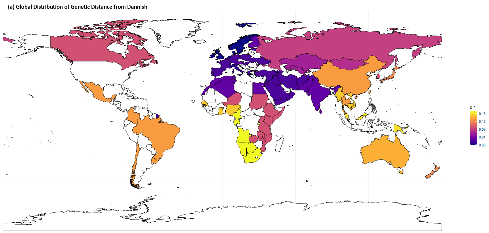

# Lactose Malabsorption Analysis
2024 KHU R Programming Project

Dongmin Kim (2021102277), JoonYeong Yu (201803608), Somi Lim (2020102770)

1. **Lactose Malabsorption and Cattle Milk**
2. **Case Study: India**
3. **Case Study: South Korea**

## Lactose Malabsorption and Cattle Milk
- Lactose Malabsorption Prevalence (LMP)
  - similar concept with lactose intolerance with values from 0 to 1
  - `/data/LM.csv` lactose malabsorption prevalence data per country
    - C. Storhaug, et al., *Country, regional, and global estimates for lactose malabsorption in adults: a systematic review and meta-analysis*, The Lancet Gastroenterology & Hepatology, Volume 2, Issue 10, 2017, Pages 738-746, ISSN 2468-1253, https://doi.org/10.1016/S2468-1253(17)30154-1.
- Cattle Milk (CM)
  - Calories/Year (KCal)
     - total calorie content of the food supply available
     - in a country, measured in kilocalories per capita per year
  - Food Supply Quantity (g/cap/d)
     - average daily quantity of food available per person
     - includes all food produced within a country or imported for consumption,
     - adjusted for losses during storage, transportation, and processing
  - `/data/FAOSTAT_data_en_11-8-2024 (1).csv` cattle milk data per country
    - *Supply Utilization Accounts (2010-)*, FAOSTAT, Food and Agriculture Organization of the United Nations, https://www.fao.org/faostat/en/#data/SCL

### Exploratory Data Analysis `/data/LM_CM.r`
1. **LMP**

- The fact that the median value of LMP is 0.73 **(a)** and there are higher frequency when LMP is closer to 1 **(b)** indicates that in almost all countries people can't digest lactose properly.
- Countries in Europe have the lowest median value of LMP. **(c)**
- In Europe, there are lots of countries that have LMP values closer to 0, meaning that the majority of residents in those countries can consume dairy products without any metabolic issues. **(d)** Some countries in Asia and Oceania show an extreme LMP value (1) and without any distribution, such as South Korea and Vietnam.
- The darker blue **(e)** represents higher LMP (closer to 1) around northern Europe such as Sweden, Norway, and United Kingdom.
-----
2. **CM**

- CM Calories/Year distribution **(a) and (b)** has many outliers.
- There is one extreme outlier **(c)** for CM Calories/Year in Asia.
- CM Food Supply Quantity distribution **(d) and (e)** shows broad range of values and some outliers.
- The group that has the highest median value in both indicators **(c) and (f)** is Eastern Europe.
- One of outliers in CM Calories/Year data **(g)** is confirmed as India. 
- One of outliers in CM Food Supply Quantity data **(h)** is confirmed as Kazakhstan.

### Clustering on LMP

- The map **(a)** shows the result after replacing each group with genetic distance values from Dannish `/data/genetic_distance_from_danish.csv`, which was selected as the starting point of the distance since that population has the lowest LMP(0) for the further clustering.
- Each values were calculated into a representative value.
  - `LMP_95%_CI_max` - `LMP_95%_CI_min` -> `LM_minmax`
  - from `CM_cal_2010` to `CM_cal_2022` -> `CM_cal_mean`
  - from `CM_fsq_2010` to `CM_fsq_2022` -> `CM_fsq_mean`
  - average temporatures from Jan to Dec -> `temp_minmax`

### Correlation between LMP and CM

- Linear regression model for (a) was `CM_cal ~ Preval_primary`.
  - `Preval_primary` = LMP
  - Coefficient of LMP was -1330996. (p = 0.596) 
- Linear regression model for (b) was `CM_fsq ~ Preval_primary`.
  - `Preval_primary` = LMP
  - Coefficient of LMP was 