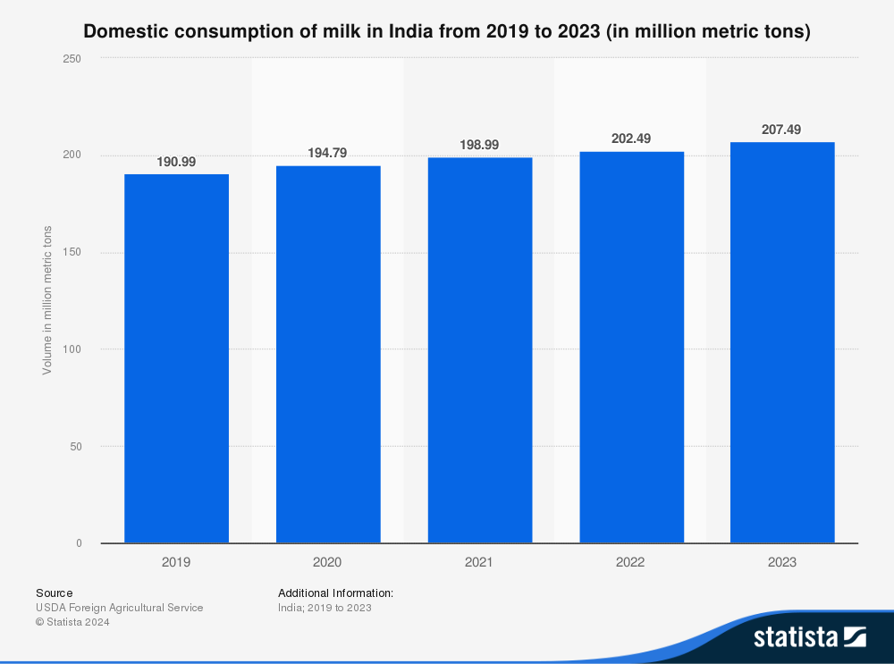
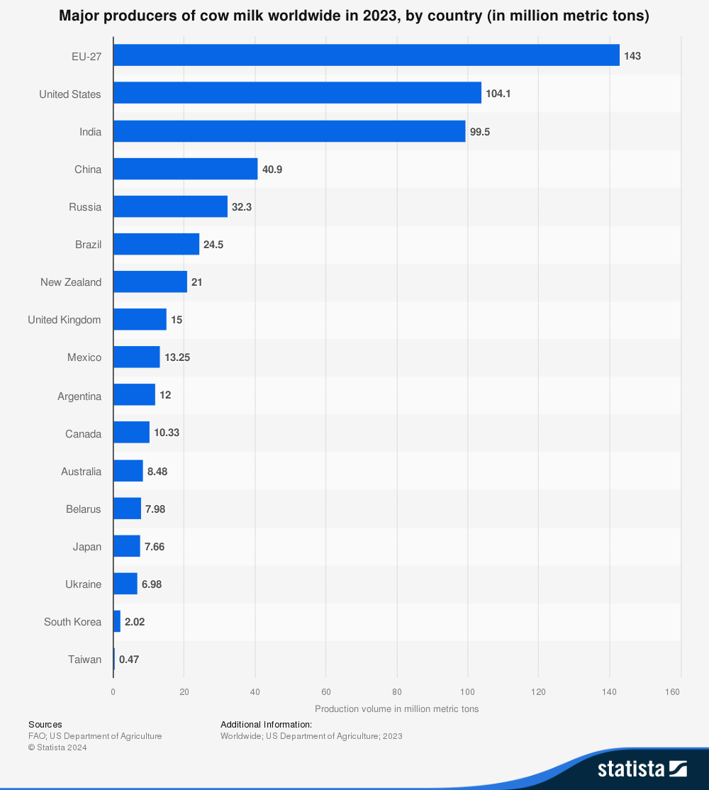
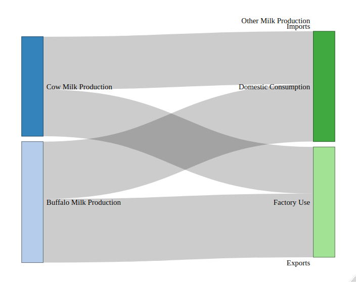
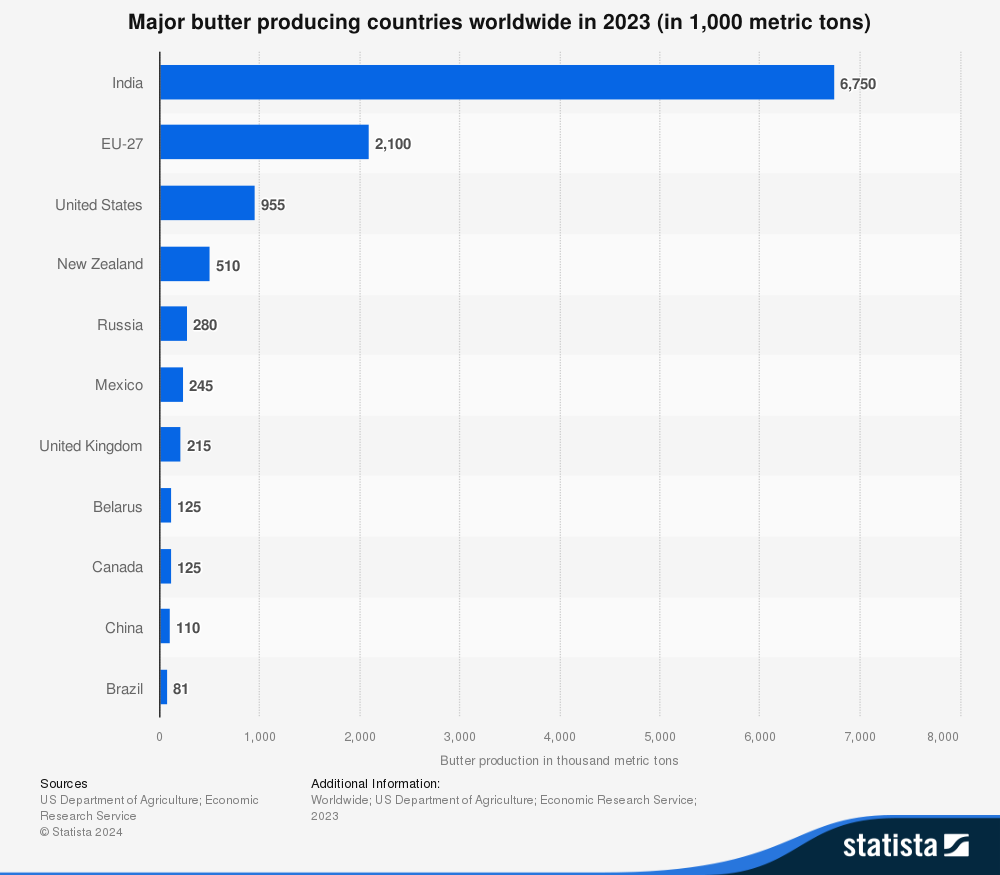

# Case Study: India

## India

India have about 65% of lactose intolerance, however it has the largest domestic consumption of fluid milk of 87MMT from 2023. The trend is everso growing since.

Northern Indians have lower lactose intolerance rate, averaging about 1/3 of population while southern indians have higher rate with 2/3 of population being affected.

And it is 3rd most larest producer of cow milk(Emphasis on cow milk), with 99.5MMT in 2023.

In 2023, India produced 99.5MMT of cow milk, and approximately 92MNT of Buffalo milk, with the percentile of buffalo milk in total milk production growing.

Despite the large production, India is not a major exporter of milk, or considering it's consumption, it is not a major importer either. The country is near self-sufficient in milk production.

### Fluid Milk Chain

Comparing the numbers, the domestic consumption of dairy milk is almost identical to production of cow milk, but accountign for all milk source, domestic consumption is approximately half of total consumption. The rest is processed into other dairy products including ghee, cheese, ...ect.

### Secondary Products

India is also the largest producer in butter industry, accounting for 6750000MT in 2023

### Conclusion

Considering the large populations being affected by lactose intolerance, the consumption is still growing. It is stated that historically india didn't have culture of consuming unfermented dairy product, but modern India consume large quantity regardless. There have been recent awareness of lactose intolerance and the market is growing for lactose-free products.
